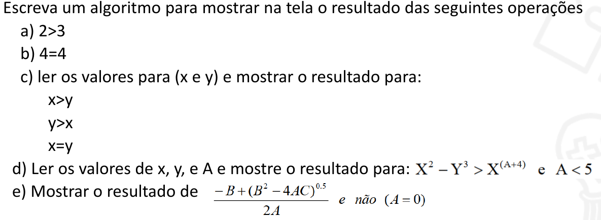

# Aula 10

1. Escreva um programa que solicite ao usuário o diâmetro de uma esfera calcule e imprima:(a área da superfície esférica e o volume da esfera.);
<style>
div{
    display:flex;
    flex-wrap:wrap;
    align-items:top;
}
div img{
    width: 550px;
}
</style>
<div>
<p>2.</p>
</div>

3. Escreva um algoritmo para ler dois valores (x,y) escreva na tela o resultado da operação lógica que verifica se a
operação diferença entre eles, é igual a zero.

4. Escreva um algoritmo para determinar a distância entre dois pontos em uma reta?

5. Uma escola tem x professores, dos quais y% ensinam Cálculo. Quantos professores ensinam Matemática nessa escola?

# CSS assembly
````
#define RESET   "\033[0m"
#define BLACK   "\033[30m"      /* Black */
#define RED     "\033[31m"      /* Red */
#define GREEN   "\033[32m"      /* Green */
#define YELLOW  "\033[33m"      /* Yellow */
#define BLUE    "\033[34m"      /* Blue */
#define MAGENTA "\033[35m"      /* Magenta */
#define CYAN    "\033[36m"      /* Cyan */
#define WHITE   "\033[37m"      /* White */
#define BOLDBLACK   "\033[1m\033[30m"      /* Bold Black */
#define BOLDRED     "\033[1m\033[31m"      /* Bold Red */
#define BOLDGREEN   "\033[1m\033[32m"      /* Bold Green */
#define BOLDYELLOW  "\033[1m\033[33m"      /* Bold Yellow */
#define BOLDBLUE    "\033[1m\033[34m"      /* Bold Blue */
#define BOLDMAGENTA "\033[1m\033[35m"      /* Bold Magenta */
#define BOLDCYAN    "\033[1m\033[36m"      /* Bold Cyan */
#define BOLDWHITE   "\033[1m\033[37m"      /* Bold White */
````


